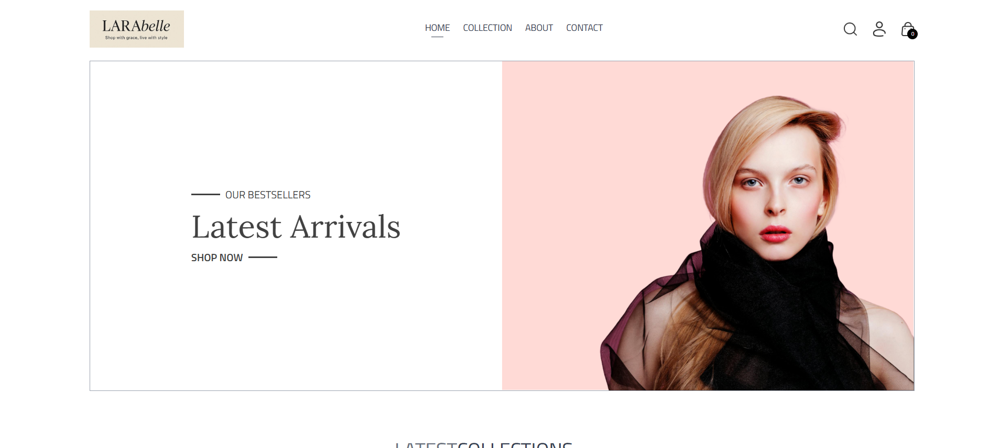

# 🛍️ MERN E-Commerce Website

> A modern, fully responsive e-commerce website built using the MERN stack. It features user authentication, product listings, shopping cart, and an admin dashboard — all wrapped in a sleek UI with light/dark theme toggle.

---

## ✨ Features

- 🔐 User Authentication (JWT-based)
- 🛍️ Product Catalog with Categories
- 🛒 Cart Management
- 💳 Checkout Flow
- 🧑‍💼 Admin Dashboard for Product & Order Management
- 🌙 Light/Dark Theme Toggle
- 📱 Responsive Across All Devices

---

## 🚀 Live Demo

**🌐 [Click here to visit the deployed site](https://larabelle-frontend.vercel.app)** 
**🌐 [Click here to visit the deployed admin dashboard](https://larabelle-admin.vercel.app)** 

---

## 🛠️ Tech Stack

| Frontend            | Backend           | Database  | Others                     |
|---------------------|-------------------|-----------|----------------------------|
|   |   |  | JWT, Redux Toolkit, React Router, Axios |

---

## 📸 Screenshots

| Home | Collections | Product Page | Cart |
|------|--------------|------|------------------|
|  |  |  |  |

| Admin-AddItems | Admin-ListItems | Admin-Orders |
|------|--------------|------|------------------|
|  |  |  |
 
---

## 📬 Contact
- Aneesha Varma
- 📧 aneeshavarma23@gmail.com
- 🔗 LinkedIn
- 💻 GitHub

---

## ⭐ Acknowledgments
- React & Tailwind CSS Docs
- MongoDB Atlas
- Vercel for free deployment
- Open Source inspirations
